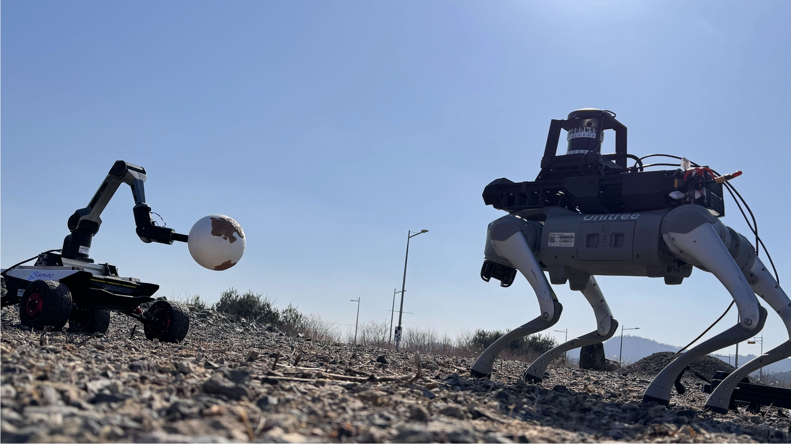

  <h1>MARSCalib</h1>
  
  
  
  <!-- 
  
   -->
   
   

**[IEEE/RSJ IROS 25]** This repository is the official code for MARSCalib: Multi-robot, Automatic, Robust, Spherical Target-based Extrinsic Calibration in Field and Extraterrestrial Environments.

  <a href="https://scholar.google.com/citations?user=ZAO6skQAAAAJ&hl=ko" target="_blank">Seokhwan Jeong</a>,
  <a href="https://scholar.google.com/citations?user=t5UEbooAAAAJ&hl=ko" target="_blank">Hogyun Kim</a>,
  <a href="https://scholar.google.com/citations?user=W5MOKWIAAAAJ&hl=ko" target="_blank">Younggun Cho</a>†

**[Spatial AI and Robotics Lab (SPARO)](https://sparolab.github.io/)**

  

  

 
 

### 🚀 Code will be uploaded soon!

 
 

## 🗞 NEWS
* [June, 2025] MARSCalib is accepted in IROS!!

 
 

##  ✉️ Contact
* **Seokhwan Jeong     eric5709@inha.edu**
* **Hogyun Kim         hg.kim@inha.edu**

(<a href="#readme-table">back to table</a>)

